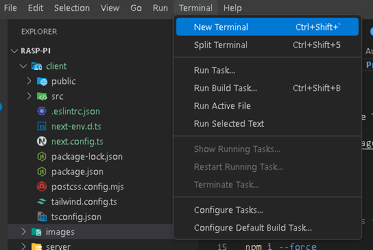

## Raspberry Pi Audio Processing Web Application

### How to install?

Open a terminal in the Terminal panel



```bash

cd ./client

# Install dependencies for frontend

npm i --force

# Run production build

npm run build

# Run the program

npm run start

```

Open a new powershell terminal


```bash

# Go to the backend

cd ./server/

# Create virtual environment

python -m venv venv

# Activate the virtual environment

./venv/Scripts/activate

# Install dependencies

pip install -r /requirements.txt

# Run the application

python app.py

```